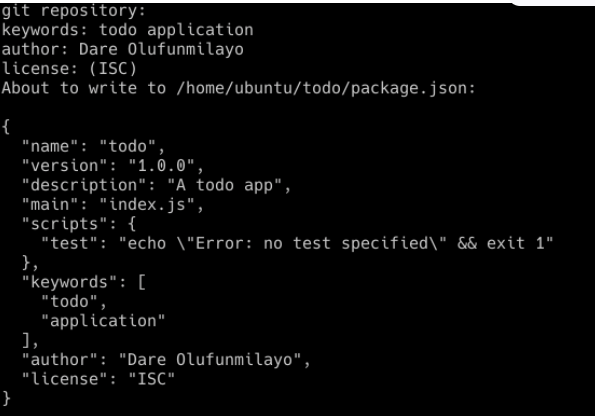

## SIMPLE TO-DO APPLICATION ON MERN WEB STACK

<In this project, I am tasked to implement a web solution based on MERN stack in AWS Cloud.
These are the steps i went through to complete this project;
>

1. Backend configuration
2. Install expressjs Models

3. Mongodb database creation
4. Frontend creation

### Backend Configuration
<These are the code i used in this step>
'sudo apt update'  
sudo apt upgrade'
 'curl -sL https://deb.nodesource.com/setup_12.x | sudo -E bash -'

<Install Node.js with the command below>
'sudo apt-get install -y nodejs'

*Application Code Setup*
mkdir Todo 
<Next, you will use the command>
' npm init'  <to initialise your project>

#

